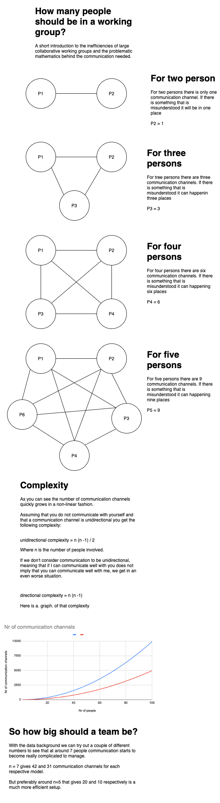

# How big should a team be?

Tags: knowledge_share

From the previous infogram you can get some background to what is called Brooks Law. I gross over-simplication of that topic would be that *adding manpower to a late software project makes it later.*

From the book The Mythical Man Month, you can read the following draft. 

> *Therefore, assigning more programmers to a project running behind schedule will make it even later. This is because the time required for the new programmers to learn about the project and the increased communication overhead will consume an ever-increasing quantity of the calendar time available. When n people have to communicate among themselves, as n increases, their output decreases and when it becomes negative the project is delayed further with every person added.*
> 
> - *Group intercommunication formula: n(n − 1)/2.*
> - *Example: 50 developers give 50 × (50 – 1)/2 = 1,225 channels of communication.*