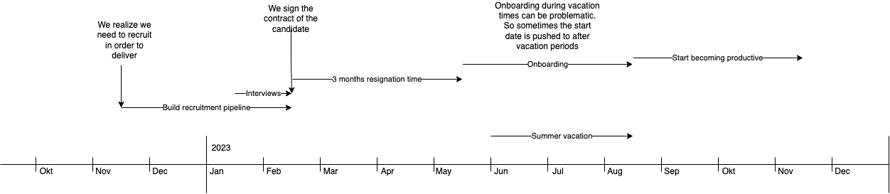

# Recruitment factors

Tags: knowledge_share, policy

# Background

Below you can see a scenario where we discover in mid nov that we need to do a recruitment. 

What is important to understand is that recruitment is slow, expensive and affecting the productivity of the team. The reasons why it’s affecting the teams include: 

- Onboarding takes time from time that could be spend on software development
- Sync meetings about the progress
- Interviews and associated meetings to sync after/before the interviews

In addition to this, if you are looking for more senior candidates some of these sections might take even longer time for recruitment, while you can expect the tome for onboarding to be somewhat faster and more efficient. 

# Senior vs Junior recruitments

Pros of junior developers: 

- Lower salary
- Easier to find than seniors, meaning shorter recruitment timeline
- If using recruiters, you can expect a recruitment cost of about 3 months salary. So with a lower salary lower costs
- More adaptable to new ideas
- Can bring in more perspectives

Cons

- Longer roadmap of onboarding, basically removing all the financial benefits of the reduced recruitment costs
- Less experienced
- Requires much more resources in general
- Can sometimes be a bit too eager to turn to over engineering

If you weight in all these aspects, at the end of the day, it’s more *financial* efficient to recruit seniors if you look over the timeline of a year. 

<aside>
💡 It’s more financial effective to recruit senior developers over the course of a year. This is without calculating in the increased productivity of a senior developer.

</aside>

In the cases where you can see the organization turning a little tired and only want to turn to the old fashioned way you might want to recruit some more junior developers to bring in some new perspectives into the tech organization. 

However, you need to be very careful about how the balance looks like. You don’t want to end up in a junior-heavy org. Use a *few* juniors to bring a good balance to the teams. 

<aside>
💡 Use junior recruitments efficently to bring in some more fresh perspectives but be very careful about turning to a junior-heavy org.

</aside>

# Signing seniors

When it comes to signing seniors there are a couple of tricks that can be used in order to get to these hard-to-reach developers. 

## Reaching out

Any senior developer can tell you how many Linkedin requests they get every day that says: 

- Hey! Your profile looks very interesting….
- Are you our next ninja/cowboy/code-guru/rockstar….

This means that any senior developer who just see the title “recruiter” in the description will simply ignore the message. In addition to that, the person that are attracted to being a code-ninja or rockstar is definitely not the type of person you want to attract anyway. 

In order to breach through in the noise on LinkedIn you need to have: 

- A C-role title of the one reaching out
- Some reasonable message that does NOT include “your profile looks interesting”.

One way of doing it is to use the CTPO/CTO/VP account to source from on the senior titles and then move over to organizing the meetings with TA agents. This has way better hit rate than using the TA agent account initially. 

## Meet and greet

For senior developers, the C-role should take the initial meeting. The reason for this is that they probably won’t be interested otherwise. 

In these 30 minutes you need to start screening real fast and within 7-10 minutes you should swap over to selling instead of screening. Since you are taking the initial meetings you will also have a higher chance of having to filter out a lot of poor candidates, something that TA otherwise might do. 

If in doubt, it’s always better to swap to selling. The candidate will have technical interviews with other people and also meet the teams. So you don’t have to worry too much about accidentally letting a poor candidate through. The purpose of this first meeting is simply to catch them and get them vested in the interview process. 

<aside>
💡 Swap to selling early on when meeting a senior role. You can always decline anyway if you need to.

</aside>

## Verify competence

Regardless of the seniority, you always need to verify the base competence. I would suggest that you always do a code test. Some people are really good at talking and one of the major benefit of being in the software development business is that it’s really easy to check if you actually can code. If you compare this to e.g a business developer or some leadership role where it’s much harder to competence check in an interview settting. 

<aside>
💡 Don’t miss out on the basics. Always do a competence check!

</aside>

## Things to watch out for

If you at any step find some problematic behaviour you should decline. It’s very expensive to recruit a person that does not make it through to the productivity phase. So if in doubt about if the person will make it, decline. 

<aside>
💡 If in doubt, decline rather than approve.

</aside>

Things to watch out for: 

- Aggressive behaviour, e.g in salary negotiations
- Overinflated self-judgement
- Rockstar behaviour
- Not being able to sort out basic meeting procedure, like being late more than once
- Too nervous to complete a coding test
- Any other behaviour that scores negative for trust factors

Being stressed in a whiteboard coding test is to be expected. However, not sorting it out because of being too nervous also means that being nervous in a hotfixing setting into production will result in the same behaviour. 

<aside>
💡 If stress effects the candidate to a degree of non-performance, you should decline. Otherwise this person can never sort out a stressful release.

</aside>

Teamwork and collaborative problem solving will always outperform individual performance. So if you have a candidate that is a great individual performer but incapable of effective collaborative teamwork you should decline since it will affect the team performance negatively. 

<aside>
💡 Decline people that performs bad on collaborative teamwork.

</aside>