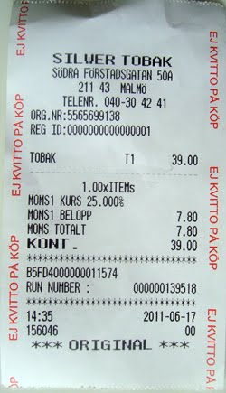
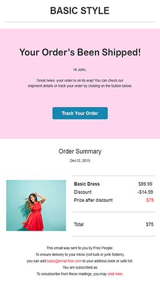
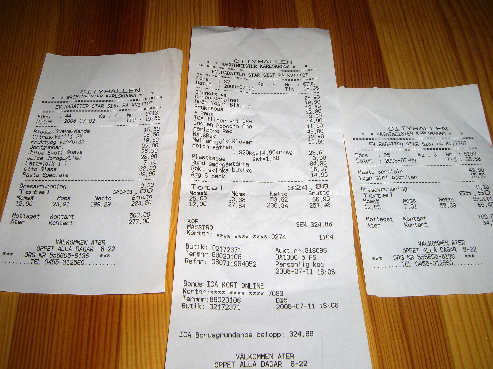

# Team activities policy

Tags: policy, team_lead

The intention is to leave team leaders with the autonomy of having a smaller subsection of the development budget. One of the reasons for this is so that the teams can do some activities, such as minigolf and dinner or pool + snacks etc. 

# What should the money be spent on

The money should be spent on activities that will: 

- Boost the morale of the team
- Activities that are inclusive of all team members
- Celebration when completing epic or projects

The money should be spent on activities that will create a nice group feeling. It's therefore important to also think carefully of how you spend them so that you not just consider certain team members. One example would be to attend a hockey game. While some team members might love hockey others might wanna spend them differently since they are not into sports. 

# Regarding drinks

It's important that, in the case of dinner and drinks, that there exist alternatives for the ones that do not wish to drink alcohol. Alcohol free beverages is a must-have when providing drinks so and of course no pressure on drinking for the ones who do not wish to do so. 

Food must be provided when also budgeting for alcoholic beverages. 

No hard liquor, only beer or wine.

If going to a restaurant, food + one drink (beer, wine or other non-alcoholic drink) is ok. After the dinner the tab should be closed and any additional drinks should be paid out of pocket. 

# Regarding tips & Receipts

The company will not reimburse tips. If you want to tip, take it on a separate receipt or in cash and pay from your own pocket. 

When sending in your receipt in Skovik, or any other expenses system, it’s preferable to use a scanned receipt. You can take a photo if you don’t have a scanner available, but please make sure the receipt is clearly visible and all information is readable. If you don't have access to a scanner you can scan it in the customer success office if you are working in HQ office. 

You should also hand in the original receipt to the person responsible for approving the expense, that will in turn hand it in to finance. 

Make sure that all fields are visible on the receipt and that it actually is a receipt. It should for example have VAT information. Sometimes when paying you get a piece of paper for the transaction. Usually it says “EJ KVITTO PÅ KÖP” in read text. This is not a valid receipt. Order confirmations are also not a valid receipt. If unsure, just check with the one that will attest it for you. 

## Examples of invalid receipts

The following example is not a valid receipt. It clearly says that it’s not a receipt. 

The following example is not a valid receipt. It’s an order confirmation that is missing some required information such as VAT.

The following example is not valid since it contains more than one receipt in the picture. You should only have one receipt per picture. 

